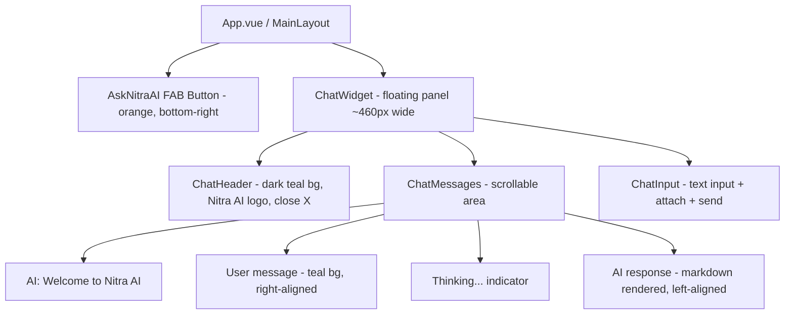

# AI Chatroom UI Implementation Plan

## Design Analysis (from Figma screenshots)

The chatroom is a **floating widget** (not a full page), positioned at the bottom-right corner of the screen. It has 4 visual states:

- **Collapsed**: Only the orange "Ask Nitra AI" FAB button is visible
- **Default/Empty**: Chat widget open with "Welcome to Nitra AI" message + "Upload your supplier list" action
- **Thinking**: After user sends a message, shows "Thinking..." indicator
- **Response**: AI response rendered with markdown (bold, numbered lists, links)

### Layout Structure




### Key Visual Specs (from screenshots)

- **Chat widget**: ~460px wide, white bg, rounded corners, drop shadow
- **Header**: Dark teal (`$teal-700: #264D4F`) background, white text, "Nitra AI" + pen icon, subtitle "Hi there, How can we help?", close (X) button
- **AI avatar**: Small teal Nitra icon (circular)
- **User messages**: Right-aligned, dark teal (`$teal-700`) bg, white text, rounded bubble
- **AI messages**: Left-aligned, light gray bg bubble, with Nitra icon avatar
- **"Thinking..."**: Same as AI message style with animated dots
- **Input bar**: Bottom-fixed, "Say something..." placeholder, paperclip (attach) icon, teal circular send button with arrow
- **FAB button**: Orange (`$orange-400: #FB7429`) bg, white text, "Ask Nitra AI" with pen icon
- **"Upload your supplier list"**: Blue square icon + text, shown in default state only
- **Markdown rendering**: Bold product names, numbered lists, "View Product" links (orange/teal), price/vendor/brand as list items

## File Structure (new/modified files)

```
src/
  components/
    chat/
      ChatWidget.vue        -- Main floating chat panel container
      ChatHeader.vue         -- Dark teal header with branding
      ChatMessages.vue       -- Scrollable message list
      ChatMessage.vue        -- Single message bubble (user or AI)
      ChatInput.vue          -- Input bar with attachment and send
      ThinkingIndicator.vue  -- "Thinking..." animated indicator
  composables/
    useChat.js               -- Chat state management (messages, send, etc.)
    useTypingEffect.js       -- Typing animation composable
  pages/
    IndexPage.vue            -- Modified: host the chat widget
  layouts/
    MainLayout.vue           -- Modified: add FAB button + ChatWidget
  mock/
    messages.js              -- Already exists, no changes needed
  css/
    app.scss                 -- Add chat-specific styles if needed
```

## Implementation Details

### 1. State Management (`useChat.js` composable)

- `messages` ref: Array of `{ id, role: 'user'|'assistant'|'system', content, timestamp }`
- `isOpen` ref: Chat widget visibility toggle
- `isThinking` ref: Show "Thinking..." indicator
- `sendMessage(text)`: Look up user text in `MESSAGE_MOCK_MAP`, push user message, set `isThinking = true`, after a short delay push AI response with typing effect
- `suggestedQuestions`: Derived from `MESSAGE_MOCK_MAP` keys for quick-select
- Initialize with a "Welcome to Nitra AI" system message

### 2. Typing Effect (`useTypingEffect.js` composable)

- Accept full response text, emit characters/chunks progressively
- Use `requestAnimationFrame` or `setInterval` (~20-30ms per character)
- Return `{ displayedText, isTyping, startTyping() }`
- Auto-scroll chat area to bottom during typing

### 3. Markdown Rendering

- Install `marked` (lightweight markdown parser) to convert AI response markdown to HTML
- Render `[Product Link](url)` as clickable "View Product" links
- Handle `[Image Link](url)` -- either show as product thumbnail or hide (based on Figma, it appears they are NOT shown inline; the "View Product" link suffices)
- Sanitize HTML output with `DOMPurify` for security
- Apply custom CSS for lists, bold, links within chat bubbles

### 4. Component Details

**ChatWidget.vue**:

- Positioned `fixed`, bottom-right, z-index high
- Transition animation for open/close (slide-up or fade)
- Contains ChatHeader, ChatMessages, ChatInput vertically stacked

**ChatHeader.vue**:

- Props: none (static content)
- Emits: `close`
- Dark teal bg, Nitra logo SVG, "Nitra AI" text + pen icon, subtitle, X button

**ChatMessages.vue**:

- Uses `useChat` composable for message list
- `v-for` over messages, renders ChatMessage for each
- Renders ThinkingIndicator when `isThinking`
- Auto-scroll to bottom on new messages
- Shows "Upload your supplier list" button when no conversation yet

**ChatMessage.vue**:

- Props: `message { role, content, timestamp }`
- Conditional styling: user (right, teal bg) vs assistant (left, gray bg with avatar)
- For assistant: render content via markdown parser with typing effect
- For user: render plain text

**ChatInput.vue**:

- Text input with placeholder "Say something..."
- Paperclip icon button (attachment, can be non-functional for now)
- Circular send button (teal bg, white arrow icon)
- Emits: `send(text)`
- Enter key to send

**ThinkingIndicator.vue**:

- Nitra avatar icon + "Thinking..." text with animated dots

### 5. Dependencies to Add

- `marked` -- Markdown to HTML parsing
- `dompurify` -- HTML sanitization (security)

### 6. Assets Needed

- Nitra logo SVG (for header and avatar icon) -- will create a simple version based on the screenshots
- Pen/edit icon -- use FontAwesome `fa-pen` or `fa-pencil`

### 7. Router Changes

- Modify [src/router/routes.js](src/router/routes.js): Clean up to just have the chat page as the main route
- The chat widget overlays on top of any page content

## Execution Order

Tasks will be executed in dependency order: data layer first, then components bottom-up, then integration.